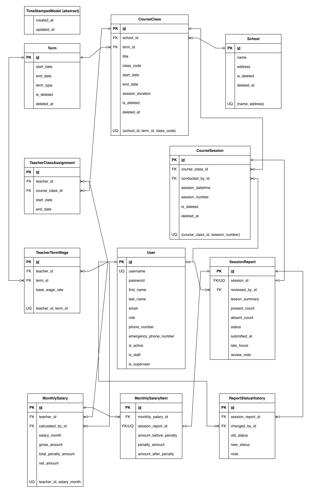

# Academic Operations & Payroll API

[](https://github.com/Vahidvhd/academic-operations-payroll-api/actions/workflows/ci.yml)
[](https://codecov.io/github/Vahidvhd/academic-operations-payroll-api)

A Django REST Framework backend for managing academic operations, instructor assignments, session reporting, approval workflows, and monthly payroll.

The project goes beyond basic CRUD by implementing role-based access control, historical teacher assignments, substitute-teacher handling, cross-model validation, audit history, soft deletion, transactional workflows, automated payroll calculations, API throttling, and end-to-end testing.

**Project status:** Complete

## Key Features

- JWT authentication with access and refresh tokens
- Three business roles: Teacher, Education Officer, and Finance Officer
- Superuser-only user creation API
- School, term, class, session, and teacher-assignment management
- Historical teacher assignments and substitute-teacher support
- Teacher-specific data visibility
- Session and assignment overlap validation
- Soft deletion for key academic records
- Report submission, rejection, resubmission, and approval workflow
- Report status audit history
- Monthly report summaries and atomic bulk approval
- 48-hour lateness calculation with hourly penalties
- Term-based wage management
- Monthly salary and per-session payroll breakdowns
- Summer-term and session-duration wage adjustments
- Global API throttling with stricter login protection
- Consistent API error responses
- OpenAPI schema and Swagger UI
- Docker Compose setup with PostgreSQL
- GitHub Actions CI and Codecov integration
- 390 automated tests, including a complete E2E workflow
- 97% test coverage

## Tech Stack

- Python 3.13
- Django 5.2
- Django REST Framework
- PostgreSQL 17
- Simple JWT
- django-filter
- drf-spectacular
- Docker and Docker Compose
- Coverage.py
- GitHub Actions
- Codecov

## Core Workflow

1. An Education Officer creates schools, terms, classes, teacher assignments, and course sessions.
2. A Teacher submits a report after completing an assigned session.
3. The report starts as `pending`.
4. An Education Officer approves or rejects the report. Rejection requires a review note.
5. A rejected report can be edited and resubmitted by the Teacher.
6. Every status change is recorded in the report history.
7. A Finance Officer sets the Teacher's wage for the relevant term.
8. Once all reports for the Teacher and month are approved, the Finance Officer calculates the monthly salary.
9. The Teacher can view only their own calculated salaries.

If a session has an explicit substitute teacher, the report and salary belong to that teacher instead of the teacher assigned to the class for that date.

## Roles and Permissions

### Teacher

Teachers can:

- view their assigned classes and sessions
- submit reports only for sessions assigned to or conducted by them
- view their own reports
- edit and resubmit rejected reports
- view their monthly report-status summary
- view their own calculated salaries

Teachers cannot manage academic data, review reports, set wages, or calculate salaries.

### Education Officer

Education Officers can:

- manage schools, terms, classes, assignments, and sessions
- view and filter submitted reports
- approve or reject reports
- bulk approve selected reports
- view report status history

### Finance Officer

Finance Officers can:

- create and view term wage rates
- update an existing wage only before its term starts
- calculate payroll for one Teacher or all eligible Teachers in a month
- view all calculated monthly salaries

### System Administrator

Django staff and superuser permissions remain separate from the three business roles.

Superusers can create application users through Django Admin or the protected user-creation endpoint. Reports and report-history records are read-only in Django Admin so the application workflow cannot be bypassed.

## Business Rules

### Academic Operations

- Terms start on the first day of a month and end on the final day of a month.
- Active terms cannot overlap.
- Class dates remain within their term.
- Session duration is limited to 60, 90, or 120 minutes.
- Teacher assignments remain within class dates and cannot overlap for the same class.
- Sessions remain within class dates and cannot overlap.
- Active session numbers are unique within each class.
- Academic records connected to submitted reports cannot be changed or deleted in ways that would break history.

### Reporting

- A report can be submitted only after its session ends.
- A Teacher can report only a session assigned to or explicitly conducted by them.
- New and resubmitted reports have `pending` status.
- Only rejected reports can be edited by a Teacher.
- Rejecting a report requires a review note.
- Editing a rejected report clears its previous review and resubmits it.
- Approved reports are final and cannot be reviewed again.
- Status transitions are stored in an audit history.

### Lateness and Payroll

- Lateness is measured from the session end until final approval.
- The first 48 hours are penalty-free.
- Any fraction of an hour after the grace period is rounded up.
- Each late hour deducts 1% of that session's amount.
- The penalty is capped at 100%, so the final session amount cannot become negative.
- Wage rates are defined for a 90-minute session.
- A 60-minute session pays 70% of the base rate.
- A 90-minute session pays 100% of the base rate.
- A 120-minute session pays 130% of the base rate.
- Summer-term sessions receive a 10% increase before penalties.
- A wage can be created after a term starts if no wage exists, but an existing wage cannot be edited after the term starts.
- Every session in the selected month must have an approved report before that Teacher's salary can be calculated.
- Recalculation updates the existing monthly salary and rebuilds its item breakdown without creating duplicates.

## API Overview

### Authentication and Users

```text
POST /api/auth/token/
POST /api/auth/token/refresh/
GET  /api/users/me/
POST /api/users/admin/create/
```

JWT access tokens remain valid for one hour and refresh tokens for one day.

### Academic Operations

```text
/api/schools/
/api/terms/
/api/course-classes/
/api/teacher-class-assignments/
/api/course-sessions/
```

These router endpoints provide the allowed list, retrieve, create, update, and delete operations according to the authenticated user's role and the resource's business rules.

### Reporting

```text
GET   /api/reports/
POST  /api/reports/
GET   /api/reports/<id>/
PATCH /api/reports/<id>/

POST  /api/reports/<id>/review/
GET   /api/reports/<id>/history/

GET   /api/reports/monthly-summary/?year=2026&month=8
POST  /api/reports/bulk-approve/
```

Reports can be filtered by school, class, teacher, and date range.

### Payroll

```text
GET   /api/teacher-term-wages/
POST  /api/teacher-term-wages/
GET   /api/teacher-term-wages/<id>/
PATCH /api/teacher-term-wages/<id>/

GET   /api/monthly-salaries/
GET   /api/monthly-salaries/<id>/
POST  /api/monthly-salaries/calculate/
POST  /api/monthly-salaries/calculate-teacher/
```

Monthly salaries can be filtered by `year` and `month`.

## API Behaviour

API errors use a consistent response structure:

```json
{
  "error_code": 400,
  "error_message": {
    "field_name": ["Validation message."]
  }
}
```

Default request limits are:

- anonymous users: 100 requests per hour
- authenticated users: 1,000 requests per hour
- login endpoint: 5 requests per minute

## Database Design

The relational data model preserves historical teacher assignments, substitute-teacher attribution, report status transitions, calculated salaries, and per-session payroll items while maintaining data integrity across the workflow.



The editable Draw.io source is available at [`docs/erd/erd.drawio`](docs/erd/erd.drawio).

## Getting Started

### Prerequisites

- Python 3.13
- Docker with Docker Compose
- Git

Clone the repository and create the environment file:

```bash
git clone https://github.com/Vahidvhd/academic-operations-payroll-api.git
cd academic-operations-payroll-api
cp .env.example .env
```

Replace the example values in `.env`, especially `SECRET_KEY` and `POSTGRES_PASSWORD`, before starting the project.

### Run the Complete Stack with Docker

Build and start the Django API and PostgreSQL database:

```bash
docker compose up --build
```

Docker Compose waits for PostgreSQL, runs migrations, and starts the API at:

```text
http://127.0.0.1:8000/
```

Stop the containers with:

```bash
docker compose down
```

### Run Django Locally with PostgreSQL in Docker

Create and activate a virtual environment:

```bash
python -m venv .venv
source .venv/bin/activate
```

Install dependencies and start only PostgreSQL:

```bash
pip install -r requirements.txt
docker compose up -d db
```

Run migrations and start Django:

```bash
python manage.py migrate
python manage.py runserver
```

### Optional Sample Users

Create one development user for each business role:

```bash
python manage.py seed_sample_users
```

Development credentials created by this command:

```text
teacher_sample    / SamplePassword@
education_sample  / SamplePassword@
finance_sample    / SamplePassword@
```

These credentials are intended only for local development.

## API Documentation

After starting the application, open:

- Swagger UI: <http://127.0.0.1:8000/api/docs/>
- OpenAPI schema: <http://127.0.0.1:8000/api/schema/>
- Django Admin: <http://127.0.0.1:8000/admin/>

## Postman Collection

A complete Postman collection is included for exploring and testing the main API workflows.

The collection covers:

- JWT authentication and token refresh
- user and role setup
- academic operations
- teacher assignments and substitute-teacher scenarios
- session reporting and review workflows
- report status history
- filtering and search
- role-based access-control checks
- individual and bulk payroll calculation
- end-to-end payroll eligibility scenarios

Files:

- [`Postman Collection`](docs/postman/academic-operations-payroll-api.postman_collection.json)
- [`Postman Environment`](docs/postman/academic-operations-payroll-api.postman_environment.json)

Import both files into Postman, select the provided environment, and add the required local credentials before running the requests.

The requests are organised in workflow order so generated resource IDs and JWT tokens can be stored automatically in Postman environment variables and reused by later requests.

## Testing

Run the complete test suite:

```bash
python manage.py test
```

Run tests with coverage:

```bash
python -m coverage run manage.py test
python -m coverage report
python -m coverage xml
```

Current verified results:

```text
390 tests passed
97% coverage
Django system check: no issues
Missing migrations: none
```

The test suite includes model, serializer, permission, API, service, throttling, payroll, and full workflow E2E coverage. GitHub Actions runs the complete suite against PostgreSQL and uploads coverage results to Codecov on every push and pull request.

## Project Structure

```text
academics/          Schools, terms, classes, assignments, and sessions
reports/            Report submission, review, history, and summaries
payroll/            Wage rates, salary calculation, and salary items
users/              Authentication, roles, permissions, and user management
core/               Shared abstract models and soft-delete behaviour
config/             Django settings, URLs, and API error handling
tests/              End-to-end workflow tests
docs/erd/           ERD image and editable Draw.io source
docs/postman/       Postman collection and environment template
.github/workflows/  Continuous integration configuration
```
